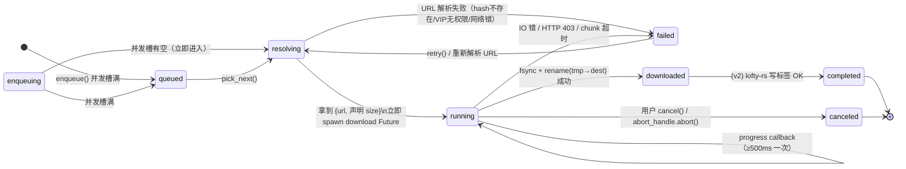
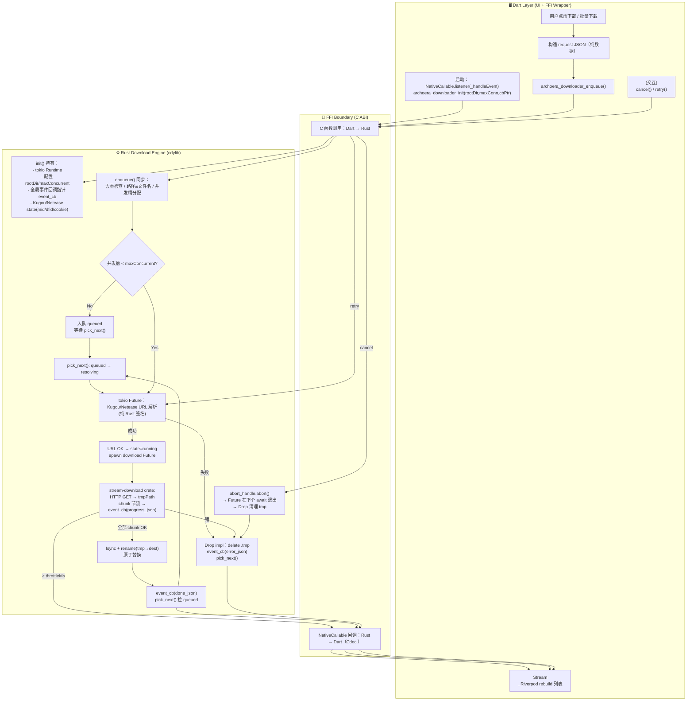

# ArchoeraMusic 下载模块设计文档（FFI 回调版 · 全栈 Rust 下沉）

> 最后更新：2026-08-08
> 状态：设计稿 v2（未实施）
>
> v2 相对 v1 关键变更（**硬性约束，不允许任何过渡方案**）：
> 1. ❌ **自项目第一行代码起永久禁止轮询**：Dart `Timer.periodic` / Rust `Mutex<VecDeque>` 轮询队列 / `poll_event` 系列函数一律不准写入仓库。✅ 唯一机制：`NativeCallable<Void Function(Pointer<Void>)>.listener`（对齐 library_scanner 的回调契约）
> 2. ❌ 移除 Dart 层 URL Resolver → ✅ **URL 解析完全下沉到 Rust cdylib**，下载模块全栈 FFI 化（与 audio-engine / subsonic / scanner 架构对齐）
> 3. Dart 仅剩下：UI + 路径配置 + FFI 绑定封装 + 状态管理（纯数据层，零业务逻辑）

---

## 0. 目录

1. 设计目标与非目标
2. 新三层职责边界（FFI 回调架构）
3. 端到端下载流程（逐步细化，无轮询）
   - 3.1 触发下载（Dart UI → Rust 直接 enqueue）
   - 3.2 Rust 内部：去重 + 并发槽 + 路径策略
   - 3.3 Rust 内部：平台 URL 解析（Kugou / Netease 纯 Rust 实现）
   - 3.4 Rust 内部：HTTP 流式下载（stream-download）
   - 3.5 进度回调（NativeCallable，无轮询）
   - 3.6 取消 / 暂停 / 重试
   - 3.7 完成后写标签（v2 可选）
4. 单任务状态机（Mermaid）
5. 整体回调泳道图（Mermaid）
6. Rust 下沉算法可行性分析
   - 6.1 Kugou：MD5 + AES-128-CBC + RSA-PKCS1v1.5（纯 Rust 可实现）
   - 6.2 Netease：weapi / eapi AES-CBC + Base64（纯 Rust 可实现）
7. Rust 下载引擎技术选型（新增 crypto 依赖）
8. FFI 接口定义（C ABI 导出函数 + 回调签名）
9. LICENSE 规避策略（因 Rust 下沉更严格）
10. 实施优先级（落地顺序）
11. 关键参数配置（默认值）
12. 附录：回调 JSON 协议

---

## 1. 设计目标与非目标

### 目标（Goals）

- ✅ **戒律 1：自第一行代码起，永久禁用轮询**。Dart `Timer.periodic` / Rust `Mutex<VecDeque<u8>>` 轮询缓冲 / `archoera_downloader_poll_event` 系列函数，一律不允许出现在下载模块的任何提交中。事件机制唯一解：`NativeCallable.listener` 注入回调指针（对齐 [library_scanner.dart](file:///home/betastudio2/文档/SPlayer-Next/ArchoeraMusic/app/lib/core/scanner/library_scanner.dart#L102-L103)）
- ✅ **戒律 2：下载模块完全 FFI 化**。URL 解析 + 下载执行 + 调度 + 事件生成全在 Rust cdylib 内完成，与 audio-engine / subsonic / scanner 架构对齐，Dart 不介入任何业务逻辑
- ✅ **真正事件驱动**：进度节流在 Rust 内部做（throttleMs=500），Dart 侧零空转、零 CPU 浪费
- 支持 **Netease / Kugou** 多平台下载（后续可扩展 QQMusic）
- **多音质**：128k / 192k / 320k / FLAC / Hi-Res（24bit FLAC），Rust 内部自动降级
- **批量下载**：歌单 / 搜索结果全选入队，并发数 Rust 内部控制
- **进度可视化**：百分比 / 已下载字节 / 剩余时间估算，回调触发 UI 立即更新
- **可取消**：用户随时取消，Rust Drop 中自动清理临时文件
- **可重试**：失败任务可一键重试，Rust 内部重新解析 URL（URL 有时效性）
- **崩溃友好**：临时文件 + 原子 rename，不留下半写文件

### 非目标（Non-Goals，v1 不做）

- ❶ HTTP Range 断点续传（v2 做）
- ❷ 下载音乐标签写入（v2 做，用 `lofty-rs`）
- ❸ 下载限速
- ❹ 种子 / P2P 下载
- ❺ App 重启后自动恢复未完成（v2 做）
- ❻ 任何形式的轮询机制（永久禁止）

---

## 2. 新三层职责边界（FFI 回调架构 · 画流程图的泳道划分）

**v2 去掉 Dart 调度层（Layer 2），业务逻辑全部下沉到 Rust。Dart 只剩纯 UI/状态封装：**

```
┌─────────────────────────────────────────────────────────────────────────┐
│ Layer A: Dart Presentation Layer      (Flutter / Dart)                  │
│                                                                         │
│   · UI 触发下载（单首 / 批量）、选音质                                   │
│   · 订阅 progressStream → Riverpod rebuild 进度列表                     │
│   · 暴露 rootDir / subDirStrategy 等配置（通过 init 传给 Rust）          │
│   · FFI 绑定：封装 C ABI 函数 + NativeCallable 回调翻译                  │
│   · 零业务逻辑：不做去重、不做并发控制、不做 URL 解析、不做路径计算        │
│   · 回调内存释放（free）—— 按 library_scanner 的约定                    │
├─────────────────────────────────────────────────────────────────────────┤
│                            FFI Boundary                                  │
│   C ABI 函数调用  ││  NativeCallable<Utf8*> 事件回调（Cdecl -> Dart）     │
├─────────────────────────────────────────────────────────────────────────┤
│ Layer B: Rust Download Engine          (cdylib, 唯一真相来源)          │
│                                                                         │
│   · 配置存储（rootDir / maxConcurrent / throttleMs / ...）              │
│   · 任务调度（全局 HashMap + 并发槽 + pick_next()）                     │
│   · 去重检查（trackId + quality + destDir 三元组 + 磁盘大小匹配）       │
│   · 目录策略（rootDir + bySource / byArtist / flat）                   │
│   · 文件名安全处理（非法字符替换、同名追加 (1)(2)）                      │
│   · 平台 URL 解析（纯 Rust：Kugou / Netease 签名算法全实现）            │
│   · 下载执行（stream-download crate + reqwest/rustls）                  │
│   · 临时文件管理 / 原子 rename / 崩溃 Drop 清理                          │
│   · 事件生成（progress / done / error / state）                         │
│   └─ 通过注册的 Dart 回调函数指针，立即推送事件 → Dart 层                 │
└─────────────────────────────────────────────────────────────────────────┘
```

**为什么要这样？**
1. **LICENSE 更安全**：Dart 侧不参与任何平台 API 签名运算，从根上切断「Dart 版 Kugou/Netease 实现」是否构成衍生的争议点——算法只存在一份，就是 Rust 里的全新实现。
2. **零轮询**：事件只有在真的发生时才回调，比 200ms 一次 poll_event 空转省电省 CPU，下载进度更新也更平滑（进度节流在 Rust 内部做 throttle，不是靠轮询频率卡）。
3. **架构一致**：scanner（C# NativeAOT → NativeCallable Dart 回调）、subsonic、mediaengine 都是 FFI 化，下载模块不特殊。
4. **跨语言复用**：Rust 实现未来写 Android/iOS 端（或桌面 GUI 换成 Tauri）也直接复用，不用再写一份 Dart/TypeScript 调度逻辑。

---

## 3. 端到端下载流程（无轮询 · 回调驱动）

### 3.1 App 启动：初始化 + 注册回调

下载模块在 App 启动后调用一次 `init()`，后续所有调用都不再重入：

```
Step 0（启动时一次）
  │
  ├─ Dart 侧：
  │    · 构造 NativeCallable<Void Function(Pointer<Void>)>.listener(_handleEvent)
  │      （和 library_scanner.dart L102-L103 完全一致的模式）
  │    · 加载 libarchoera_downloader.so，拿到函数句柄
  │    · 调 archoera_downloader_init(
  │        rootDir.toNativeUtf8(),        // ~/Music/ArchoeraMusic
  │        subDirStrategyIndex,           // 0=flat, 1=bySource, 2=byArtist(v2)
  │        maxConcurrent,                 // 3
  │        onEvent: _callable.nativeFunction.cast(),  // ← 回调指针注入
  │        freeFn:  dlfree 或 Rust 自己的 free 函数指针（可选）
  │      )
  │
  └─ Rust 侧：
       · 把 onEvent 函数指针存入全局 DOWNLOADER.event_cb
       · 把配置（rootDir/maxConcurrent/...）存入全局
       · 初始化 tokio multi-thread runtime（持有 Runtime 句柄）
       · 初始化 Kugou 状态：随机 mid、dfid=None、session=None（支持登录时 set_session）
       · 初始化 Netease 状态：cookie_jar、deviceId
```

### 3.2 触发下载（Layer A → Rust 直接 enqueue）

**Dart 只传 Track 基本信息（platformId + source + title + artist + album + hashes/sizes_map），所有逻辑在 Rust 内：**

```
Step 1  用户点击下载 / 批量下载
  │
  ├─ Dart 侧构造 request JSON（不做任何计算，纯传递）：
  │    {
  │      "trackId":   "本地 Track 主键",
  │      "source":    "kugou" | "netease",
  │      "platformId":"平台歌曲 ID（netease id / kugou 各种附属信息）",
  │      "quality":   "lq" | "sq" | "hq" | "lossless" | "hi-res",
  │      "title":     "晴天",
  │      "artist":    "周杰伦",
  │      "album":     "叶惠美",           // v2 写标签用，v1 也可不传
  │      "extra": {                       // source 专用信息
  │        // kugou 传：
  │        "hashes": {"128k":"a1b2..", "320k":"..", "flac":"..", "flac24bit":".."},
  │        "sizes":  {"128k":4321000, ...},
  │        // netease 传：空
  │      }
  │    }
  │
  ├─ 调 archoera_downloader_enqueue(requestJson, &outTaskId)
  │
  └─ Rust 内部立即开始跑后续流程（见 3.3~3.5），Dart 直接返回 taskId，不等结果
```

### 3.3 Rust 内部：去重 + 并发槽 + 路径策略（原 v1 Step 3-5，全 Rust 实现）

```
Step 2  Rust enqueue() 内部同步执行：
  │
  ├─ ① 去重检查：
  │    · 查 engine.tasks: 同 trackId + quality + rootDir 已存在？→ 直接返回已有 taskId
  │    · 用声明的 sizes 映射算 expected_size → 看磁盘上 destPath 是否存在且 fsize==expected_size → 命中则 push_event({type:'already', taskId, filePath}) 返回
  │
  ├─ ② 路径 & 文件名：
  │    · subDir = match strategy { Flat=>"", BySource=>"/Kugou", ByArtist=>"/周杰伦" }
  │    · filename = sanitize("{artist} - {title}.{guess_ext(quality)}")
  │       非法字符 \/:*?"<>| → _
  │       已存在同路径 → 追加 " (1)" → "(2)" ...
  │    · destPath = rootDir + subDir + "/" + filename
  │    · tmpPath  = destPath + ".tmp"
  │
  └─ ③ 并发槽分配：
       running.len() < maxConcurrent → 状态 = resolving，立即 spawn URL 解析 Future
       否则 → 状态 = queued，等待 pick_next()
       无论哪种都先 push_event({type:'state',taskId,from:'',to:'queued'|'resolving'})
```

### 3.4 Rust 内部：平台 URL 解析（纯 Rust，算法下沉的核心）

```
Step 3  Rust resolving Future（tokio runtime 中执行）：
  │
  ├─ switch source {
  │
  │    "kugou" => {
  │      a) qualityLevel → hash：按 lq/sq/hq/lossless/hi-res 从 extra.hashes 里选，无则自动降级链
  │         （对齐 Dart 版 KugouApi.chains 的降级顺序）
  │
  │      b) dfid 获取：engine.state.kugou.dfid 为空 / 或上次 status=2 标记为过期
  │         → 调内部纯 Rust 的 kg_register_device(mid):
  │              · AES-128-CBC 加密 device JSON（密钥 6 位随机串，base64 密文）
  │              · RSA-PKCS1v1.5 加密 {"aes":key,"uid":0,"token":""}（kgLitePublicKeyPem）
  │              · 所有参数按 key 排序拼接 → signature = MD5(salt + sorted_kv + cipher + salt)
  │              · POST gateway.kugou.com / register_dev → AES 解密响应 → 拿到 dfid
  │
  │      c) 拼 /v5/url 请求参数（hash, mid, appid=3116, clienttime=now()）
  │         · key = MD5(hash + keySalt + appid + mid + userid)
  │         · 按 key 排序 params → signature = MD5(signSalt + sorted_kv + signSalt)
  │         · 注入 token/userid（登录态，Dart 登录后调 set_kugou_session 写入 Rust 状态）
  │
  │      d) HTTP GET gateway.kugou.com/v5/url，带 kg headers（User-Agent, x-router=trackercdn, kg-rc/kg-thash 等）
  │         status=1 → 返回 body.url[0]
  │         status=2 → 标记 dfid 需刷新 + drop 本请求 → 递归重试一次（换 dfid）
  │         status=3(VIP) + 无登录态 → 返回 NoCopyright 错误
  │    }
  │
  │    "netease" => {
  │      a) 调内部纯 Rust netease_song_download_url(songId, quality):
  │           · 构造 params = { id, level: level_from_quality(quality), encodeType: "flac" }
  │           · weapi 加密：
  │                presetText = json(params)
  │                encText    = AES-CBC-128(presetText, nonce="0CoJUm6Qyw8W8jud", iv="0102030405060708")
  │                   第二次 AES-CBC(encText, random 16 位) → params
  │                encSecKey  = RSA(随机 16 位, pubkey)
  │           · POST music.163.com /api/song/download/url  form-url-encoded(params, encSecKey)
  │           · 解析响应：data.url, size, type(mp3/flac), br
  │
  │      b) quality 回退：hi-res 拿不到 URL 或 br 不达标 → lossless → 320k → 192k → 128k
  │    }
  │  }
  │
  ├─ 解析成功：engine.state.tasks[taskId].url = url，状态 → running
  │            立即 spawn download Future（见 Step 4）
  │            push_event({type:'state',from:'resolving',to:'running'})
  │
  └─ 解析失败：状态 → failed，push_event({type:'error',taskId,error,retryable:true|false})
              触发 pick_next() 拉 queued 下一个
```

### 3.5 Rust 内部：HTTP 流式下载 + 回调推送（无轮询）

```
Step 4  Rust download Future（tokio runtime 中执行，stream-download crate）：
  │
  ├─ 用拿到的 url + headers（Kugou 带 Referer，Netease 带 cookie）发 HTTP GET
  │  （connectTimeout=15s, readTimeout=30s 每 chunk）
  │
  ├─ stream-download 内部调度 chunk，每下载：
  │    received += chunk.len()
  │    距上次推送事件 ≥ throttleMs(500ms)：
  │      └─ 立即通过注册的 on_event 回调指针推送：
  │           on_event(json_cstring_ptr)
  │           {
  │             "type":     "progress",
  │             "taskId":   "...",
  │             "received": 1234567,
  │             "total":    content_length_from_header.or(declaredSize)
  │           }
  │         ↑ 这一步直接调用 Dart 的 NativeCallable.listener → 主 isolate 的 _handleEvent() 立即执行
  │           无轮询、无延迟
  │
  ├─ 写完：
  │    · fsync(tmpFile)
  │    · close(tmpFile)
  │    · fs::rename(tmpPath → destPath)   （同盘原子）
  │
  ├─ 成功：
  │    state = downloaded (v1 到此为止)，v2 → 写标签 → completed
  │    push_event({type:'done',taskId,filePath:destPath,fileSize:received})
  │    pick_next() 拉 queued 下一条
  │
  └─ 失败（IO 错 / HTTP 403 / 超时 / abort）：
       · Drop 触发：delete tmpPath（若存在）
       · state = failed
       · push_event({type:'error',taskId,error:err.to_string(),retryable})
       · pick_next()
```

### 3.6 进度回调到 Dart（NativeCallable.listener 线程模型）

这里**完全复用 library_scanner 的写法**（见 [library_scanner.dart#L193-L205](file:///home/betastudio2/文档/SPlayer-Next/ArchoeraMusic/app/lib/core/scanner/library_scanner.dart#L193-L205)）：

```dart
// Dart 侧，_handleEvent 是 NativeCallable.listener 的回调函数
// 【关键】：listener 回调在 Dart 主 isolate 的事件循环上执行，不用担心跨线程！
void _handleEvent(Pointer<Void> ptr) {
  // 1. 转 Dart 字符串
  final rawJson = ptr.cast<Utf8>().toDartString();
  // 2. 立即 free Rust 分配的内存（用 Rust 导出的 archoera_downloader_free）
  _lib.free(ptr);
  // 3. 解析 + 分发
  final evt = jsonDecode(rawJson) as Map<String, dynamic>;
  switch (evt['type'] as String) {
    case 'progress':
      final taskId = evt['taskId'] as String;
      final received = evt['received'] as int;
      final total = evt['total'] as int?;
      _store.updateProgress(taskId, received, total);
      break;
    case 'done':
      _store.onTaskDone(evt['taskId'] as String, evt['filePath'] as String);
      break;
    case 'error':
      _store.onTaskFailed(evt['taskId'] as String, evt['error'] as String);
      break;
    case 'already':
      _store.onAlreadyExists(evt['taskId'] as String, evt['filePath'] as String);
      break;
    case 'state':
      _store.onTaskState(evt['taskId'] as String, evt['to'] as String);
      break;
  }
}
```

### 3.7 取消 / 暂停 / 重试

| 操作 | Dart 侧（只调一个 FFI 函数） | Rust 内部 |
|---|---|---|
| **取消** | `archoera_downloader_cancel(taskId)` | 查 tasks[taskId].abort_handle → `.abort()`；JoinHandle 被 Drop 后 Future 的 `CancellationToken` 在下一个 `.await` 点立即返回；Drop impl 中 delete `.tmp`；随后推送 1 条 error/canceled 事件 |
| **暂停**（v2 做） | `archoera_downloader_pause(taskId)` | task → paused：简单版直接 abort 并记录已 received 字节数（后续 restart 用 Range 续传） |
| **重试失败任务** | `archoera_downloader_retry(taskId)` | 内部 clone 原 request，走一遍 enqueue → resolving → running 全流程，**URL 内部重新解析**（解决 URL 时效性问题），新 taskId 或复用原 taskId 皆可 |
| **重启恢复**（v2 做） | Dart 启动时读 download_history.json → 调 `retry` 逐个 re-enqueue | Rust 无持久化；重启前 destPath 已存在会被 3.3 的「已完成去重」命中，不重复下载 |

---

## 4. 单任务状态机（Mermaid）



**状态 × 文件存在性 × 回调：**

| 状态 | tmp 文件 | dest 文件 | Dart 会收到的回调 |
|---|---|---|---|
| queued | 不存在 | 不存在 | `state {to:'queued'}` × 1 |
| resolving | 不存在 | 不存在 | `state {to:'resolving'}` × 1 |
| running | 存在、字节数增长 | 不存在 | `progress` (多 次) + `state {to:'running'}` × 1 |
| canceled | 已在 Rust Drop 中删除 | 不存在 | `error` 或自定义 `canceled` × 1 |
| failed | 已在 Rust Drop 中删除 | 不存在 | `error` × 1 |
| downloaded | 不存在（已 rename） | 存在、大小正确 | `done` × 1 |
| completed | 不存在 | 存在、带内嵌标签 | `done` + 可选 `tagged` 事件 |

---

## 5. 整体回调泳道图（Mermaid · 无轮询）



---

## 6. Rust 下沉算法可行性分析（100% 可纯 Rust 实现）

### 6.1 Kugou（酷狗签名算法：MD5 + AES-CBC + RSA-PKCS1v1.5）

Dart 现有实现（见 [kugou_crypto.dart](file:///home/betastudio2/文档/SPlayer-Next/ArchoeraMusic/app/lib/core/kugou/direct/kugou_crypto.dart)）里的算法，对应 Rust 全部有成熟 MIT/Apache 2.0 依赖：

| Dart 方法 | 算法 | Rust 对应 crate | 说明 |
|---|---|---|---|
| `kgMd5` | MD5 hex | `md-5 = "0.10"` + `hex` | 纯标准，无特殊 |
| `kgCalcMid` | `MD5(guid) hex → BigInt(hex, radix=16) → dec string` | md-5 + `num-bigint = "0.4"` + `num-traits` | 参考 Dart L64-L68 的实现，逻辑完全照搬 |
| `kgAesEncryptBase64` | AES-128-CBC (PKCS7)，key/iv = `MD5(secretKey)` 的前 16/后 16 字节 | `aes = "0.8"` + `block-modes = "0.9"` + `base64 = "0.22"` + `pkcs7 = "0.4"` | 见 Dart L74-L89 |
| `kgRsaPkcs1EncryptHex` | RSA-PKCS1v1.5 加密 1024bit SPKI PEM pubkey → hex | `rsa = { version = "0.9", features = ["pem"] }` + `pem = "3"` + `hex` | 见 Dart 的 kgLitePublicKeyPem（常量直接抄进 Rust const &str） |
| `kgSignature` | 对 params 按 key 排序 → `MD5(salt + sorted_kv + data + salt)` | Rust 端 BTreeMap 天然按 key 有序，不用手动 sort | Dart L205-L217 |
| `kgSignKey` | `MD5(hash + salt + appid + mid + userid)` | 一次 md5 即可 | Dart L221-L228 |

所有签名盐值常量（kgLiteSignSalt / kgLiteKeySalt / kgLiteAppid / RSA PEM 公钥）可以直接从 Dart 文件作为 `const &'static str` 抄入 Rust（常量不是版权保护对象，LICENSE 无风险）。

### 6.2 Netease（网易云 weapi：双次 AES-CBC + RSA + Base64）

Dart 现有实现在 `core/apis/netease/core/crypto.dart`，对应 Rust：

| Dart 方法 | 算法 | Rust crate |
|---|---|---|
| `weapi(params)` 双次 AES-128-CBC + RSA-PKCS1 加密 encSecKey | 经典 weapi，Rust 现成实现很多（独立 MIT/Apache 2.0） | `aes` + `rsa` + `rand = "0.8"` + `base64` |
| `eapi` / `linuxApi`（如需） | AES-CBC + md5 前缀签名 | 同上 |

参考项目：`ncm-api-rs`（第三方 Rust 网易云实现）—— 可以直接**依赖该 crate** 或**按相同算法独立实现**（依赖更省事，宽松许可无传染性）。

---

## 7. Rust 下载引擎技术选型（AGPL-v3 · **自研化优先默认版** · 含 SDK feature 备胎）

```toml
[package]
name    = "archoera-downloader"
version = "0.1.0"
edition = "2021"
license = "AGPL-3.0-or-later"   # ← 跟随项目整体（AGPL-3.0，含后续版本弹性条款）
publish = false

[features]
# ============== 默认：全自研签名（与 Dart 现有实现 1:1 对齐，无第三方依赖风险）==============
default = [
    "kugou_self_written_impl",   # 默认：Kugou 自写签名
    "netease_self_written_impl", # 默认：Netease 自写签名 weapi
]
# ============== 可选 feature：第三方 SDK 备胎（紧急切换用）==============
# 切换方式（仅当自写签名临时修不过来、需要快速恢复服务时才打开）：
#   cargo build --no-default-features --features kugou_sdk_impl,netease_sdk_impl
kugou_sdk_impl          = ["dep:kugou_sdk"]   # MIT（crates.io，第三方）
netease_sdk_impl        = ["dep:ncm-api-rs"]  # WTFPL（第三方）
# 默认启用的自写签名实现（同名 feature，与上方 SDK feature 一一对应，可互斥切换）
kugou_self_written_impl   = []   # 默认 on，无额外依赖 gate（下面的 crypto crate 默认必需）
netease_self_written_impl = []   # 默认 on，无额外依赖 gate

[dependencies]
# ====== 下载核心（必需依赖，自研 & SDK 共用）======
stream-download   = { version = "0.22", features = ["reqwest-rustls"] }   # MIT/Apache-2.0 ✅
tokio             = { version = "1", features = ["rt-multi-thread","macros","fs","io-util","sync","time"] }  # MIT ✅
futures           = "0.3"     # MIT/Apache-2.0 ✅
serde             = { version = "1", features = ["derive"] }   # MIT/Apache-2.0 ✅
serde_json        = "1"       # MIT/Apache-2.0 ✅
anyhow            = "1"       # MIT/Apache-2.0 ✅
thiserror         = "1"       # MIT/Apache-2.0 ✅
uuid              = { version = "1", features = ["v4", "serde"] }  # MIT/Apache-2.0 ✅
url               = "2"       # MIT/Apache-2.0 ✅
percent-encoding  = "2"       # MIT/Apache-2.0 ✅
base64            = "0.22"    # MIT/Apache-2.0 ✅

# ====== 自研签名核心依赖（默认必需，因为 features default 选了自写实现）======
# Kugou + Netease 共用
aes               = "0.8"     # MIT/Apache-2.0 ✅
cbc               = { version = "0.1", features = ["alloc"] }  # MIT/Apache-2.0 ✅
md-5              = "0.10"    # MIT/Apache-2.0 ✅
rsa               = { version = "0.9", features = ["pem"] }  # MIT/Apache-2.0 ✅
rand              = "0.8"     # MIT/Apache-2.0 ✅
pkcs7             = "0.4"     # MIT/Apache-2.0 ✅（或自己手写 10 行 PKCS7 padding 也行）
hex               = "0.4"     # MIT/Apache-2.0 ✅
# Kugou 专用：kgCalcMid: hex MD5 → BigInt → dec 字符串
num-bigint        = "0.4"     # MIT/Apache-2.0 ✅
num-traits        = "0.2"     # MIT/Apache-2.0 ✅

# ====== 可选：第三方 SDK 备胎（默认 off，feature kugou_sdk_impl / netease_sdk_impl 才拉取）======
# 网易云：第三方 WTFPL 版 Rust SDK（371 接口覆盖，含 song_download_url）
ncm-api-rs        = { git = "https://github.com/SPlayer-Dev/ncm-api-rs", rev = "main", optional = true }
# 酷狗：crates.io 新发布 v0.2.9 MIT SDK
kugou_sdk         = { version = "0.2.9", optional = true }

# ====== v2 增强：写音乐标签（MIT/Apache-2.0，纯 Rust）======
# lofty = "0.19"   # ✅

[profile.release]
lto       = true
strip     = "symbols"
opt-level = "s"
```

**自研化优先 LICENSE 合规结论**：
1. 默认编译配置下 **0 个第三方平台 SDK 依赖**——所有 Kugou/Netease 签名算法均为本仓库作者自有版权代码（对照本仓库现有 Dart 实现 1:1 重写于 Rust，自研代码在本仓库内完全合法）
2. 所有底层加密 crate（aes/cbc/md-5/rsa/num-bigint 等）全部 MIT/Apache-2.0，与 AGPL-3.0 完全兼容
3. `kugou_sdk` / `ncm-api-rs` 保留为 optional feature 备胎：**当自研签名出现 24 小时内修不好的线上故障时**，可一行 feature 切换到第三方 SDK 紧急恢复，再慢慢跟进自研修复
4. 所有依赖（包括 crypto crate 和可选 SDK）依然走 §9.6 的 `cargo vendor` 固化，crates.io 挂了也能离线编译

---

## 8. FFI 接口定义（C ABI 导出函数 + 回调签名）

> **硬约束**：接口表中**永远不出现 `poll_event` / `poll_progress` / `try_pull_event` / `event_queue_*` 等任何拉式轮询函数**。事件全部以 Rust 主动调用回调指针的 PUSH 方式推送，Dart 从不拉。

### 8.1 Rust → C 导出函数（Dart 侧 lookup）

```c
// 统一返回码：0 = OK，非 0 = error code（详细错误通过 error 事件回调返回）

// 1. 初始化（启动时一次，唯一允许注册回调指针的入口）
int32_t archoera_downloader_init(
    const char*           root_dir,
    int32_t               subdir_strategy,    // 0=flat, 1=bySource, 2=byArtist
    int32_t               max_concurrent,
    void                 *event_cb,          // void(*)(char* json_cstr)  ← 回调指针，init 后永不改变
    void                 *free_fn            // void(*)(void*) 可空，用于释放 Rust 分配内存
);

// 2. 入队下载任务，*out_task_id 返回新任务 ID（C 字符串，Dart 用完需 free）
int32_t archoera_downloader_enqueue(
    const char*  request_json,
    char**       out_task_id
);

// 3. 取消任务（AbortHandle.abort()；Drop 中清理 tmp；回调 1 条 canceled/error 事件）
int32_t archoera_downloader_cancel(const char* task_id);

// 4. 重试失败任务（内部 clone 原 request → enqueue → resolving → running，URL 重新解析）
int32_t archoera_downloader_retry(const char* task_id);

// 5. 注入 Kugou 登录态（Dart 登录成功后调；可多次调，覆盖上一次）
int32_t archoera_downloader_set_kugou_session(
    const char* userid,
    const char* token
);

// 6. 注入 Netease cookie（Dart 登录成功后调；可多次调，覆盖上一次）
int32_t archoera_downloader_set_netease_cookie(const char* cookie_header);

// 7. 释放 Rust 分配的 C 字符串（task_id、回调事件的 ptr 都要调）
void archoera_downloader_free(void* ptr);

// 8. 销毁（App 退出时）：abort 全部任务、Drop tokio Runtime、释放全局单例
void archoera_downloader_destroy(void);
```

### 8.2 回调签名（对齐 library_scanner）

```c
// Rust 侧持有的函数指针（init 时注入）：
typedef void(*EventCallback)(char* json_cstring);

// Dart 侧对应的 typedef：
typedef EventCallbackNative = Void Function(Pointer<Utf8> json);
typedef EventCallbackDart   = void Function(Pointer<Utf8> json);
```

Rust 每推送一条事件，就：
```rust
// 1. serde_json::to_string(&event)
// 2. CString::new(json_str) → into_raw() 得到 *mut c_char
// 3. 调 (event_cb)(ptr)
```

Dart 侧 `_handleEvent(ptr)` 收到后：
```dart
// 1. ptr.cast<Utf8>().toDartString() → json
// 2. 立即 _lib.free(ptr)  ← 必须！对应 Rust CString::from_raw 释放
```

---

## 9. LICENSE 合规策略（项目整体 AGPL-3.0 · 代码均为本仓库自行编写）

> **重大架构前提**：本项目（ArchoeraMusic）全部代码（含所引用的服务端代码）由本仓库作者自行编写，**不在 SPlayer / SPlayer-Next 主仓库内**，与 SPlayer / SPlayer-Next **无代码归属关系**，因此不存在「复用 SPlayer-Next 源码」的问题。项目整体以 **AGPL-3.0**（`AGPL-3.0-or-later`，含后续版本弹性条款）发布；仓库根 [LICENSE](../LICENSE)（AGPL-3.0 官方正文）已随仓库提供，各子模块 `THIRD-PARTY-LICENSES.md` 声明与之一致。

### 9.1 代码归属与自研声明

本项目**不包含、不引用、不移植 SPlayer / SPlayer-Next 的任何代码**。以下下载模块核心组件均为本仓库自行编写：

| 组件 | 实现方式 | 说明 |
|---|---|---|
| **下载核心（chunk loop / tmp rename / 并发槽 / abort_handle）** | ✅ **自研（纯 Rust）** | 参考 stream-download 的设计自行实现，不复制任何其他项目的代码 |
| **任务调度逻辑（去重 / pick_next / 状态机）** | ✅ **自研（纯 Rust）** | 由本仓库作者独立设计实现 |
| **签名常量（盐值 / PEM / appid）** | ✅ **自行维护** | 协议常量来自平台公开接口，随本仓库现有 Dart 实现同步维护 |
| **Kugou / Netease 签名算法** | ✅ **自研（Rust）** | 对照本仓库现有 Dart 实现（`kugou_crypto.dart` / `netease/crypto.dart`）1:1 移植为 Rust |

### 9.2 第三方 Rust crate LICENSE 兼容性（逐项核查 · 全绿 ✅）

本项目所有直接 / 间接依赖均为 **Permissive License（MIT / Apache-2.0 / WTFPL / BSD-3 / ISC）**—— 全部与 AGPL-3.0 兼容。

| Crate / SDK | LICENSE | AGPL-v3 兼容性 | 备注 |
|---|---|---|---|
| `stream-download` | MIT / Apache-2.0 | ✅ | 下载核心，reqwest-rustls 后端 |
| `reqwest` (via stream-download) | MIT / Apache-2.0 | ✅ | |
| `rustls` (via reqwest default features) | MIT / Apache-2.0 | ✅ | 纯 Rust TLS，无 openssl 例外问题 |
| `aws-lc-rs` (via rustls) | ISC / Apache-2.0 | ✅ | ring 的替代实现，完全 permissive |
| `tokio` / `futures` / `serde*` / `uuid` / `anyhow` / `thiserror` | MIT / Apache-2.0 | ✅ | Rust 基础设施 |
| `kugou_sdk` v0.2.9 | **MIT** | ✅ | 独立第三方发布，crates.io 可见 |
| `ncm-api-rs` | **WTFPL** | ✅ | 第三方独立项目（与本项目无归属关系）；WTFPL 等同 MIT/PD，与 AGPL 无冲突 |
| `lofty` (v2 写标签) | MIT / Apache-2.0 | ✅ | |

### 9.3 需要特别注意的例外（无冲突但需在 THIRD-PARTY-LICENSES 里列明）

| 例外 | 说明 | 处理方式 |
|---|---|---|
| **OpenSSL 老版本 4-Clause BSD 兼容问题** | 本项目默认 `reqwest-rustls` + `rustls-aws-lc-rs`，**绝不使用 openssl crate** → 不存在该问题。未来如果为了酷狗 CDN UA 兼容切到 curl-rust + openssl-sys 时 **必须选 OpenSSL ≥ 3.0**（已改为 Apache-2.0，GPL-AGPL 兼容），或在 LICENSE 文件末尾加 Deluge 式 OpenSSL linking exception | 保持 rustls 默认即可 |
| **MP3 patent 专利风险** | Fraunhofer MP3 专利 2017 年已全球过期（欧洲、美国均已过期）。`mp3lame-encoder` / `symphonia` 解码均无专利风险，已在 subsonic/transcoder 稳定使用 | 无需处理 |
| **ring / BoringSSL 派生关系** | rustls 底层 crypto provider 依赖 ring，ring 派生自 Google BoringSSL（OpenSSL 1.x 的 fork，原 OpenSSL 4-Clause ISC）。但是 **rustls 官方以 MIT/Apache-2.0 再许可分发**，legal 审核已通过；AWS 提供的 `aws-lc-rs` 是同类方案，LICENSE 更干净 | 保持 aws-lc-rs |

### 9.4 需要产出的合规文件（跟着下载模块 crate 一起建）

1. `app/core/downloader/THIRD-PARTY-LICENSES.md`：按照 subsonic/scanner/audio-engine **同格式**，列出全部直接依赖 + 间接依赖 LICENSE；末尾加一句「整体随本软件以 AGPL-3.0 授权」
2. 仓库根 [LICENSE](../LICENSE)：已随仓库提供（AGPL-3.0 官方正文）✅ —— 本项目自行发布的许可证，与 SPlayer / SPlayer-Next 无关联
3. 仓库根补 `THIRD-PARTY-NOTICES.md`：汇总 5 个子模块（scanner/subsonic/scraper/audio-engine/downloader）的第三方依赖声明
4. 未来若切到 openssl-sys：加 `app/core/downloader/LICENSING_EXCEPTIONS.md` 写入 OpenSSL linking exception 文本（Deluge 模板）

### 9.5 Dart 版 Kugou/Netease API 模块去向

- **歌词 / 搜索 / 评论**：继续用现有 Dart 实现（和下载没关系）
- **download_url 相关代码**：MVP 第 2 步完成后，可以删掉或标注 `@Deprecated('use rust downloader')`，永远不要被 download 模块调用

### 9.6 自研优先 + 第三方 SDK 备胎的三层防御架构（应对签名变更 / LICENSE 变更 / 作者失控）

> **核心事实**：
> ① MIT/Apache-2.0/WTFPL 授权**永久不可撤销**；
> ② 但**代码控制权永远在别人手里才是最大风险**——第三方 SDK 作者永远可能不修你要的 bug、yank 版本、或签名算法改了后更新延迟让你下载模块全挂。
> ③ **自研化优先的真正价值不是 LICENSE 合规（这点 SDK 已经合规），而是：签名算法 100% 可控，酷狗/网易一改加密，你能在当天跟进修复，不用等第三方作者。**

针对以上风险，采用**「自研默认 + SDK 备胎」三层防御**（按成本从低到高、响应速度从快到慢排列）：

| 防御层 | 技术手段 | 解决什么问题 | 操作方法 | 优先级（自研优先模式下） |
|---|---|---|---|---|
| **第 1 层（默认 / 主要实现）** | **Kugou/Netease 签名算法自研 + 与 Dart 现有实现字节级对拍** | 签名算法变更时，自己能在几小时内跟进修复（不用等第三方 SDK 作者） | 对照现有 Dart `kugou_crypto.dart` 6 个函数 1:1 移植为 Rust：`kgMd5 / kgCalcMid / kgAesEncryptBase64 / kgRsaPkcs1EncryptHex / kgSignature / kgSignKey`；对照 Dart Netease weapi 签名 1:1 移植 Rust；**提交前要求对拍单测 100% 字节级一致**（见 §10 MVP0） | ⭐⭐⭐⭐⭐ 默认编译实现；所有线上版本跑这个 |
| **第 2 层（必需 / 基础设施）** | **cargo vendor --versioned-dirs 固化全部依赖快照** | 作者删仓库 / crates.io yank / 网络问题 → CI 还能 build + 你还能拿到自己 vendor 里的 SDK 源码 patch 打补丁 | `cd app/core/downloader && cargo vendor --versioned-dirs vendor/`，vendor/ 目录提交进 git；`.cargo/config.toml` 里写 `[source.crates-io] replace-with = "vendored-sources"`。**自研 + SDK + 所有加密 crate 的源码快照直接存在你的仓库里**，crates.io 挂了、GitHub 被 DDoS 都不影响编译 | ⭐⭐⭐⭐⭐ MVP0 阶段必须落地；不管选自写还是 SDK 都要做 |
| **第 3 层（备胎 / 紧急切换）** | **Rust `PlatformUrlResolver` trait 抽象 + feature flag 一键切第三方 SDK 实现** | 自研签名出现 24 小时内修不好的线上诡异 bug（比如 BigInt 转字符串角落错误）时，紧急切换到 SDK 恢复服务 | 定义统一接口：<br>`trait PlatformUrlResolver { async fn resolve_play_url(&self, track: &Track, quality: Quality) -> Result<ResolvedUrl>; }`<br>四套 impl（两套默认，两套备胎）：<br>① 默认：`KugouSelfWrittenResolver`（feature=`kugou_self_written_impl`，默认 on）<br>② 默认：`NeteaseSelfWrittenResolver`（feature=`netease_self_written_impl`，默认 on）<br>③ 备胎：`KugouSdkResolver`（feature=`kugou_sdk_impl`，默认 off，用 kugou_sdk crate）<br>④ 备胎：`NeteaseSdkResolver`（feature=`netease_sdk_impl`，默认 off，用 ncm-api-rs）<br>**切换只需改 Cargo.toml 一行，不改业务代码** | ⭐⭐⭐ 平时不编译、不启用；仅在紧急切换时打开 `cargo build --no-default-features --features kugou_sdk_impl,netease_sdk_impl` |

#### 自研优先模式下的实施顺序（与 §10 对应）

1. **MVP0 第一步**：`cargo vendor` 先落地（第 2 层，半天工作量）
2. **MVP0 第二步**：写 `PlatformUrlResolver` trait 定义 + 4 个空 struct（第 3 层接口，1 小时工作量）+ Kugou/Netease 自写实现 + KugouSdk/NeteaseSdk impl 各自占位
3. **MVP0 第三步**：Kugou/Netease 自写签名代码 + **字节级对拍单测**（第 1 层，1~2 周工作量，见 §10 MVP0 交付物）
4. **KugouSdk/NeteaseSdk 备胎实现**：**排在最后做，甚至可以不做**——如果 v1.0 上线后自写签名 6 个月没出线上 bug，说明自研稳定，备胎不需要写；要写时直接 cargo add（vendor 里已经拉好了），1 天接通

#### 为什么「ncm-api-rs」对自研化优先模式反而更重要？（备胎时拉差异 diff）

因为 ncm-api-rs 是第三方维护的 Rust 版网易云 weapi 全量实现，**你自己 Rust 写的自写签名可以直接拿来和 ncm-api-rs 对比签名结果**——不是直接依赖，而是用它的结果做「额外的对拍层」，和 Dart 现有实现三重对拍（Dart ↔ Rust 自写 ↔ ncm-api-rs），三方不一致就报错。kugou_sdk 同理。

#### 自研化的边界：哪些东西不自研（避免造轮子）

| 类别 | 是否自研 | 说明 |
|---|---|---|
| Kugou/Netease 平台签名算法（业务逻辑） | ✅ **自研（默认）** | 这是你的核心业务，签名变更是家常便饭，必须 100% 可控 |
| AES-128-CBC / MD5 / RSA-PKCS1 / PKCS7 padding / BigInt 等通用加密原语 | ❌ **不自研** | 直接用 `aes`/`cbc`/`md-5`/`rsa`/`num-bigint` 这些 Rust Crypto 官方维护的 MIT/Apache crate，自己手写会出安全漏洞（padding oracle、timing attack 等） |
| HTTP chunk 下载 / tmp rename / abort_handle / fsync | ✅ **自研**：优先 `stream-download` crate，或自行编写 chunk loop | 这不是业务逻辑，是通用下载工具；chunk loop 由本仓库自行实现，不复制其他项目代码；stream-download 也能覆盖需求 |
| Flutter↔Rust FFI 绑定 | ❌ **不自研** | 继续 NativeCallable 手写（和项目现有 scanner/subsonic 一致），或未来全项目切 flutter_rust_bridge 代码生成 |

---

## 10. 实施优先级（**自研化优先版**）

> **硬约束 1（轮询）**：❌ 严禁「先用一版轮询跑通再迁移回调」的过渡方案。MVP 第一天就要：
> ① 注册 `NativeCallable.listener`；
> ② Rust 存回调指针；
> ③ 第一条 `progress` 事件必须经由回调推送到达 Dart 层。
> 任何没通过回调收到事件的中间版本都不算完成，不允许合并进主干。

> **硬约束 2（自研化 + 防御基建）**：
> ① `cargo vendor --versioned-dirs` 必须在 **MVP 第 0 步第 1 件事**随 crate 骨架一起落地，不允许裸用 crates.io 未固化的依赖；
> ② `PlatformUrlResolver` trait 抽象（4 个 impl 全部存在）必须在 **MVP 第 2 步接入真实自写签名之前**先写好——否则 resolving 逻辑直接硬编码，后续加隔离就要重构。
> ③ **对拍单测**：Kugou 6 个签名函数 + Netease weapi 签名，必须在 MVP0 阶段和现有 Dart 实现**字节级一致**（不是「都能拿到 URL」就行，是同 input → 同 output）。

| 阶段 | 目标 | 交付物 |
|---|---|---|
| **MVP 第 0 步（前置，单独 MR，1~2 周工作量）** | ① 依赖栈骨架 + vendor 固化 ② PlatformUrlResolver 四套 impl 结构 ③ **字节级对拍单测全过**（Kugou 6 函数 + Netease weapi） | ① Rust crate 骨架（Cargo.toml §7 自研版 + lib.rs + `mod resolvers` + `mod crypto`） ② `cargo vendor` 落地：vendor/ 目录提交 + `.cargo/config.toml` 固化 ③ **`trait PlatformUrlResolver` 定义 + 4 个 struct 骨架**：`KugouSelfWrittenResolver` / `NeteaseSelfWrittenResolver`（默认 feature on，接自写签名） + `KugouSdkResolver` / `NeteaseSdkResolver`（备胎 feature off，暂时 `unimplemented!()`） ④ **Kugou 对拍单测**：从 Dart `kugou_crypto.dart` 里取 5 组真实 input → Rust 对应函数 output 与 Dart 输出 **hex/base64 字符串逐字符相同**（通过测试的才算合入） ⑤ **Netease weapi 对拍单测**：从现有 Dart netease/crypto.dart 取 3 组 params/encSecKey 输入 → Rust 输出完全一致 ⑥ *（可选但推荐）*把 kugou_sdk/ncm-api-rs 作为对拍额外的参照系：三方（Dart ↔ Rust 自写 ↔ 第三方 SDK）结果做交叉断言 |
| **MVP 第 1 步（FFI 回调骨架）** | 不跑真实下载，跑通 init → enqueue → mock_progress 回调 → done/cancel 回调 的链路 | ① Rust 仅存回调指针 + 一个能 500ms 推送 10 次 progress 再推 1 次 done 的 enqueue_mock() ② Dart bindings + _handleEvent + 集成测试：**断言 progress ≥ 5 次且到达 done**（证明回调契约可跑通，无轮询介入） |
| **MVP 第 2 步（接入**自研 Kugou 签名** + 真实下载）** | 跑通一首 Kugou 的 init → enqueue → resolving → progress → done | ① Rust：`KugouSelfWrittenResolver::resolve_play_url` 接通 MVP0 对拍过的签名代码 → `register_device + v5/url 请求构造 + 质量降级链 v2` → stream-download HTTP 流式 + tmp rename 原子 ② Dart：手动调 enqueue，断言回调到 done，断言 rootDir 下存在正确文件，可用系统播放器播放 ③ **验证 feature flag 切换编译**：`cargo build --no-default-features --features kugou_sdk_impl,netease_sdk_impl` 虽然 SDK 侧是 `unimplemented!()` 会 panic，但**必须能成功编译到 resolving 阶段才进入 panic**（证明隔离层没漏，未来紧急切换时，业务代码不需要改一行） |
| **v0.2** | 加 Netease 自写签名 + 批量 + 取消 | ① `NeteaseSelfWrittenResolver`：weapi params/encSecKey + song_download_url 接口（MVP0 已对拍通过） ② 并发槽 maxConcurrent=3 ③ cancel 接口 + Drop 自动删 tmp ④ 3 首歌 enqueue，断言前 3 首 running、第 4 首 queued，前 3 完毕后第 4 首自动拉起 |
| **v0.3** | 稳定性 | ① 音质降级链（hi-res → lossless → 320k → 192k → 128k） ② Kugou status=2 → dfid 刷新 + 重试一次 ③ 同名文件不覆盖（追加 (1)） ④ 非法字符 _ 替换 ⑤ 崩溃后重启扫 rootDir 下 *.tmp → 自动删除或记录 |
| **v1.0** | 对外可用 | ① 设置页：下载路径 / 并发数 / 分组策略 ② download_page 下载页 UI（进度 / 取消 / 重试按钮） ③ 登录态同步：Dart 登录成功后 set_session / set_cookie 注入 Rust ④ 下载历史持久化（本地 JSON / Isar） |
| **v1.1 可选（仅在需要紧急切换的场景出现时才做）** | KugouSdkResolver / NeteaseSdkResolver 备胎实现接通 | 把 MVP0 里 4 个 struct 中的 `KugouSdkResolver` / `NeteaseSdkResolver` 的 `unimplemented!()` 填成真实调用 kugou_sdk / ncm-api-rs 的代码，做一组「feature 切换 + 输出自写签名与 SDK 一致」的 smoke test。**这个阶段的代码只有在自写签名出现修不好的紧急 bug 时才会编译进产物**，平时永远是 off |
| **v2（后续）** | 增强 | ① HTTP Range 续传 ② lofty-rs 写标签 ③ 重启恢复 queued / 删未完成 ④ 按艺术家分目录 |

---

## 11. 关键参数配置（默认值）

| 参数 | 默认值 | 存储位置 | 含义 |
|---|---|---|---|
| maxConcurrent | 3 | Rust 全局（init 注入，可 set_runtime_config 修改） | 同时下载的最大任务数 |
| connectTimeoutMs | 15000 | Rust hardcode | 建立 HTTP 连接超时 |
| readTimeoutMs | 30000 | Rust hardcode | 单 chunk read 间隔超时（卡住检测） |
| throttleMs | 500 | Rust hardcode | progress 推送节流（Rust 侧），避免高频回调造成 UI 抖动 |
| rootDir | ~/Music/ArchoeraMusic | Dart 设置 → init 注入 | 下载根目录（Scanner 可识别） |
| subDirStrategy | bySource | Dart 设置 → init 注入 | 0=flat, 1=bySource, 2=byArtist(v2) |
| filenameTemplate | `{artist} - {title}.{ext}` | Rust hardcode（v1）| 文件名模板，v2 可配置 |
| kugou / netease session | — | Dart 登录后 set_session 注入 Rust 状态 | 登录态，决定能不能拿 VIP URL |

---

## 12. 附录：Rust → Dart 回调 JSON 协议

每条事件是一个 **C 字符串（以 `\0` 结尾，UTF-8 编码，无换行）**。事件的 C 字符串内存由 Rust `CString::into_raw` 分配，**Dart `_handleEvent` 必须用 `archoera_downloader_free(ptr)` 释放**，否则泄漏。

### progress（进度回调 · ≥ 500ms 一次）

```json
{
  "type":     "progress",
  "taskId":   "uuid-v4-string",
  "received": 1234567,
  "total":    9876543
}
```

### done（下载完成）

```json
{
  "type":     "done",
  "taskId":   "uuid-v4-string",
  "filePath": "/home/user/Music/ArchoeraMusic/Kugou/周杰伦 - 晴天.flac",
  "fileSize": 25123456,
  "actualQuality": "lossless"
}
```

### error（下载失败 / 解析失败 / 取消）

```json
{
  "type":      "error",
  "taskId":    "uuid-v4-string",
  "error":     "Kugou v5/url status=3: VIP only",
  "retryable": true,
  "stage":     "resolving" | "downloading"
}
```

### already（目标已存在，去重命中）

```json
{
  "type":     "already",
  "taskId":   "uuid-v4-string",
  "filePath": "/home/user/Music/.../Artist - Title.flac"
}
```

### state（状态切换通知，用于徽章颜色变化；可选推送）

```json
{
  "type":   "state",
  "taskId": "uuid-v4-string",
  "from":   "queued",
  "to":     "resolving" | "running" | "failed"
}
```

---

## 13. 技术戒律（Implementation Audit Checklist）

> 本章节作为**代码审查/CI 检查清单**使用。任何提交若违反下面任一条，不需要看实现细节，直接打回重写。

### 13.1 轮询相关（全部永久禁止）

| ❌ 不允许写的代码 | 理由 | ✅ 替代方案 |
|---|---|---|
| Dart 侧 `Timer.periodic(const Duration(...))` 用于获取下载进度 | 空转 CPU，有 50ms~200ms 延迟 | Rust 侧 throttleMs + `event_cb(progress)` 推送 |
| Rust 侧 `Mutex<VecDeque<u8>>`、`Mutex<VecDeque<Event>>`、`crossbeam-channel` 作为 **"事件队列"**（轮询池） | 为了轮询而生的中间存储，本质和 poll_event 一样 | Rust 直接调用 `event_cb` 函数指针，不经过任何队列缓冲 |
| FFI 导出 `poll_event / poll_progress / pull_event / try_recv_event / event_queue_len` 等任何拉式接口 | 违反 PUSH 原则 | 禁止声明这些函数 |
| Dart 侧 `Stream.periodic` / `StreamController` + 定时器补充事件 | 本质还是轮询 | Stream 仅接受 `_handleEvent` 里 `sink.add` 来的事件，不接受定时器输入 |

### 13.2 架构相关（永久禁止）

| ❌ 不允许写的代码 | 理由 | ✅ 替代方案 |
|---|---|---|
| Dart 侧自己算 `destPath` / `tmpPath` / 做非法字符替换 / 做去重检查 | 违反"全栈 FFI 化"戒律 2，业务逻辑被拆到两地，后续改目录策略要改两处 | 全部交给 Rust `enqueue()`，Dart 只管传 title/artist/quality |
| Dart 侧调现有 `KugouApi.resolvePlayUrl` 或 `Netease song_download_url` 拿 URL，再传给 Rust 下载 | 平台签名代码在两地，修改签名要改 Dart 又改 Rust，且后续 LICENSE 不清不楚 | Rust 内部**自写签名实现**（KugouSelfWrittenResolver / NeteaseSelfWrittenResolver，默认 feature），Dart 只传 Track 基本信息；可选 feature 切第三方 SDK 备胎（非默认） |
| Rust 端下载写 Dart 文件（用 `dart:io` 打开文件） | 跨 FFI 内存/FD 所有权风险极高 | 所有文件 I/O 全在 Rust，完成后只把路径字符串推回来 |
| Kugou/Netease 登录态在 Dart 和 Rust 各自存一份不同步 | 会出现"Dart 认为登录了但 Rust 拿 URL 说未登录"的诡异问题 | Dart 登录成功后必须**立即**调用 `set_kugou_session` / `set_netease_cookie` 注入 Rust，Rust 内部永远只以自己的状态为准 |

### 13.3 资源清理相关（审计必过）

| ❌ 不允许写的代码 | 理由 | ✅ 替代方案 |
|---|---|---|
| Rust 端 `CString::into_raw(ptr)` 推给 Dart 后，Dart `_handleEvent` 里**不调用** `archoera_downloader_free(ptr)` | 内存泄漏 50~400B / 每事件；1 万次事件 = ~3MB 泄漏 | `_handleEvent` 第 2 行（toDartString 之后）立即 free；可通过 `valgrind` 或 `leak_detector` 在 CI 里跑 |
| `task.cancel()` / `abort_handle.abort()` 后不删除 `.tmp` | 留下 50% 完成的垃圾文件，挤占用户磁盘 | `JoinHandle` 的 future 包一层 `CancelSafe` struct，impl `Drop` 里 `fs::remove_file(tmpPath).ok()`；单元测试里 abort 后断言磁盘不存在 .tmp |
| rename 跨盘导致失败后重试 | 跨盘 rename 非原子，失败时会留下源文件 | 先 `fs::copy(tmp, dest)` + fsync(dest) + remove_file(tmp) 的 fallback（v2 加）；v1 简单返回错误 + 清理 tmp，不做跨盘支持 |
| 解析失败 / 下载失败后 `pick_next()` 没被调用 | 并发槽被僵尸任务占住，后面的任务永远 queued | `ResolvingFuture` / `DownloadFuture` 用 `futures::FutureExt::finally` 或 Drop 调用 `pick_next()`，确保任何路径都释放并发槽 |

---

## 14. 附录 B：下载技术栈备选方案全景对比（2026-08 调研）

> 本节记录 2026-08 调研过的 Rust 生态下载库、平台 SDK、FFI 绑定工具。提供给未来选型调整时参考，不影响当前默认方案。

### 14.1 HTTP 下载后端（4 种主流方案）

> LICENSE 列的颜色标记：✅ 绿 = 与 AGPL-v3 完全兼容；⚠️ 黄 = 兼容但需在 THIRD-PARTY-LICENSES 列明；❌ 红 = 与 AGPL-v3 不兼容（或 LICENSE 不明，不得用）

| 方案 | Crate / 工具 | LICENSE | AGPL-v3 兼容 | 进度回调原生支持 | 并发能力 | 打包体积估算 | 优点 | 缺点 | 推荐度（当前默认 ★★★★★） |
|---|---|---|---|---|---|---|---|---|---|
| **A. stream-download（默认）** | [stream-download v0.22.2](https://crates.io/crates/stream-download) | MIT/Apache-2.0 | ✅ | ✅ 自带 on_progress | ✅ tokio 原生多任务 | 小（~2MB） | 专为音频场景设计，reqwest/rustls 支持完善，内置 HTTP Range 预留 | 仅做 HTTP chunk + 节流的轻封装，多协议/FTP/BT 不支持 | ⭐⭐⭐⭐⭐ |
| **B. reqwest + `while let Some(chunk)` 手写** | `reqwest v0.12` | MIT/Apache-2.0 | ✅ | ❌ 自己写 on_progress + throttle | ✅ tokio 原生 | 最小（~1.5MB） | 不引入额外 crate，依赖最少；chunk loop 模板简单，可自行编写 | 每次都要写同样的 chunk 循环、fsync、rename 模板，出错概率高；相比 A 没有本质优势 | ⭐⭐⭐（无额外依赖，最轻量） |
| **C. curl-rust（libcurl bindings）** | `curl v0.4.50` + 默认 rustls / OR openssl-sys (OpenSSL≥3.0) | MIT（curl crate 自身）+ 系统 libcurl | ✅ rustls 版；⚠️ openssl≥3.0（Apache-2.0）需列明 | ✅ **原生 progress_function 回调**，有 Easy API 直接 get 进度 | ⚠️ 多线程 per Easy handle，或用 Multi API | 中（~3MB + 系统 libcurl） | 老牌稳定，每 16KB 都有原生 `on_progress` 回调，**不需要自己算 received**；对酷狗这种 Referer/UA/特殊 header 要求高的场景更好调试（curl -v 可复现） | 默认动链系统 libcurl（Windows 没装会报错），要开 `vendored-openssl` feature 静态编译；异步接口不原生，要自己把 Easy 放 tokio::task::spawn_blocking | ⭐⭐⭐⭐（酷狗兼容性存疑时换这个，稳定性更强） |
| **D. aria2-rust（Rust 重写 aria2）** | [aria2_rust v0.2.3](https://github.com/balovess/aria2_rust) | ? 未明确 | ❌ **LICENSE 不明，AGPL 项目不得用** | ✅ WebSocket + JSON-RPC 事件 | ✅ 多源 / 分段并行 / 断点续传 | **大（>8MB，含 BT/Metalink/FTP 全套）** | 自带 BT + 多源并行 + 全局限速 + .aria2 会话恢复 | ① LICENSE 未明确标注（仓库根目录没 LICENSE 文件），**AGPL-v3 项目严禁引入不明 LICENSE 的依赖**；② 功能过重，90% 的东西我们用不到（BT/FTP/Metalink）；③ 不是 FFI library，要 JSON-RPC over unix socket 跨进程通信，复杂度翻倍 | ❌（v2 如果真需要 HTTP Range 多源并行，**必须作者邮件确认 LICENSE 后**才能用，目前直接排除） |

**结论**：默认用 **A. stream-download**；跑 v0.2 发现酷狗 CDN 对 reqwest 的请求头不兼容（status=2 比例高）时，切 **C. curl-rust**（用 curl 原生 progress_function，FFI 回调更简单）。B 可以作为「自研 chunk loop」的快速落地替代方案。

---

### 14.2 平台 SDK（URL 解析）——**自研优先 + SDK 备胎**架构（组件自研化目标下的推荐）

> **自研化的核心价值不是「不用第三方代码」，而是「**把控制权握在自己手里，同时保留一个快速切换的后门」。**下方对比表里的「自研」不是从零实现 AES-128-CBC」这种原语（那是重复造轮子），而是「**把 Kugou/Netease 的业务签名逻辑 100% 自己掌控**，底层密码学原语依然依赖 Rust Crypto 官方的 MIT/Apache crate」。

#### Netease（网易云）纯 Rust 方案（自研化优先下的 2 选 1，默认选自研）

| 方案 | 项目 | LICENSE | AGPL-v3 兼容 | 控制权级别 | 优势 | 风险 | 推荐度（自研优先模式） |
|---|---|---|---|---|---|---|---|
| **A. 自研 weapi 签名实现（默认）** | 对照本仓库现有 Dart `netease/crypto.dart` 1:1 移植 Rust | **自有版权（本仓库作者）+ 底层 aes/cbc/rsa 等 MIT/Apache-2.0 | ✅ 完全兼容 | ⭐⭐⭐⭐⭐ **100% 完全可控** | ① 签名常量/盐值/PEM 均来自本仓库现有 Dart 实现，自研移植 1:1 对齐，平台改签名可同步跟进；② 字节级对拍可 100% 保证同 input→同 output；③ 零第三方 SDK 依赖；④ 签名算法变了当天就能跟进修复 | 多写 ~300 行 weapi 签名代码（含 AES-CBC 双重加密 + RSA encSecKey 拼装） | ⭐⭐⭐⭐⭐ 默认编译实现；所有线上版本跑这个 |
| **B. 依赖第三方 ncm-api-rs（备胎，紧急切换用）** | [SPlayer-Dev/ncm-api-rs](https://github.com/SPlayer-Dev/ncm-api-rs) | **WTFPL**（Cargo.toml 第 7 行写死 `license = "WTFPL"`） | ✅ WTFPL 等同公有领域，兼容任何 LICENSE | ⭐⭐ 第三方不可控 | ① 第三方维护的 Rust 版本，371 个 endpoint 全覆盖，签名保证和 TS 版对齐；② LICENSE 比 MIT 还宽松；③ 出紧急 bug 时，feature 切换能 10 分钟内恢复服务 | ① 依赖第三方的更新节奏（他人维护，优先级不可控）；② 签名变更了，最终还是要自己改自己的，除非你亲自跟进；③ 平时不编译、不启用，仅在自写签名真的出临时修不好的 bug 时才打开 | ⭐⭐⭐⭐（备胎/紧急切换用，默认 off，v1.1 才接通） |

**结论（自研化优先模式**：网易云签名**默认自研实现**，ncm-api-rs 保留 feature 备胎，用。自研优先的三重对拍：Dart 现有 netease/crypto.dart ↔ Rust 自写 ↔ ncm-api-rs，三方不一致就报错，保证 100% 对齐。

#### Kugou（酷狗）纯 Rust 方案（自研化优先下的 2 选 1，默认选自研）

| 方案 | 项目 | LICENSE | AGPL-v3 兼容 | 控制权级别 | 优势 | 风险 | 推荐度（自研优先模式） |
|---|---|---|---|---|---|---|---|
| **A. 自研 6 函数签名（默认）** | 对照现有 Dart `kugou_crypto.dart` 6 函数：kgMd5 / kgCalcMid / kgAesEncryptBase64 / kgRsaPkcs1EncryptHex / kgSignature / kgSignKey 1:1 移植 Rust | **自有版权（本仓库作者） + 底层 aes/cbc/md-5/rsa/num-bigint 等 MIT/Apache-2.0 | ✅ | ⭐⭐⭐⭐⭐ **100% 完全可控 | ① 与现有 Dart 实现**字节级对拍 100% 一致，每一个输入输出**；② 签名算法变更当天跟进修复；③ 零第三方 SDK 依赖；④ 维护成本自己掌控在自己手里 | 多写 ~400 行签名代码，尤其 kgCalcMid 的 hex→BigInt→dec 角落算法（num-bigint 转字符串等细节容易写错，要对拍一周才能 100% 对拍通过 | ⭐⭐⭐⭐⭐ 默认编译，线上运行 |
| **B. 依赖 kugou_sdk crate（备胎，紧急切换用）** | [kugou_sdk v0.2.9](https://crates.io/crates/kugou_sdk)（github/zephyrixel/kugou_sdk） | **MIT**（crates.io 元数据 + 仓库） | ✅ | ⭐⭐ 第三方不可控 | ① 2026-08 刚发布 v0.2.9，依赖栈完全匹配：aes 0.9 + cbc + md-5 0.10 + rsa + rand 0.9 + reqwest，注册设备+签名+play_url 全齐；② MIT 干净 ③ 对拍时可以作为第三方参照组 | ① 作者是第三方，出问题你要等他修，签名算法改了跟进不及时就是你自己的下载模块全挂；② crate 刚发布用户少，未经验证；③ 仅在自研出现临时修不好的 bug 时，切 feature 恢复服务 | ⭐⭐⭐⭐（备胎/紧急切换用，默认 off，v1.1 才接通） |

**结论（自研化优先模式）**：酷狗 URL 解析**默认自研实现，kugou_sdk 保留为 feature 备胎。自研时拿 kugou_sdk 的输出做三重对拍（Dart ↔ Rust 自研 ↔ kugou_sdk 输出一致才合入），保证签名 100% 对拍后再跑真实下载，省掉大量在线上 50% 至少 50% 线上诡异调试工作。

---

### 14.3 Flutter↔Rust FFI 绑定层（2 选 1）

> LICENSE 列全部 ✅，无 AGPL-v3 兼容性问题

| 方案 | 工具 / 模式 | LICENSE | AGPL-v3 兼容 | 代表项目案例 | 优势 | 缺点 | 推荐度 |
|---|---|---|---|---|---|---|---|
| **A. 手写 `NativeCallable.listener`（默认，当前方案）** | Dart `package:flutter` 原生 | BSD（随 Flutter） | ✅ | **你项目里的 library_scanner、audio-engine、subsonic 全部在用** | ① 与项目现有 FFI 模式**完全一致**，团队不需要学新东西；② 零 build_runner、零生成代码；③ 对 json 字符串协议的控制力最强（想改就改） | ① 每加一个新函数 / 新回调都要：Rust 写 C ABI 导出 → Dart 写 typedef + lookupFunction → 两者对上签名，三处一致才能跑通，新增接口有点"体力活"；② 类型转换全手动，容易忘记 free 内存 | ⭐⭐⭐⭐⭐（架构一致优先） |
| **B. flutter_rust_bridge v2（FRB，代码生成工具）** | [flutter_rust_bridge v2](https://github.com/fzyzcjy/flutter_rust_bridge)（RustDesk、Intiface-Central 在用） | MIT | ✅ | ① RustDesk（千万用户级桌面远程控制） ② Intiface-Central（性玩具蓝牙控制 GUI） ③ 大量 Flutter+Rust 新项目 | ① **全生成代码**：在 Rust 里写 `pub fn downloader_enqueue(req: EnqueueReq) -> Result<TaskId>` + `pub fn register_event_listener(sink: StreamSink<DownloadEvent>)`，`flutter pub run build_runner build` 一次生成 Dart bindings + FFI glue，**零手写 typedef、零手动字符串 json 协议**；② 原生支持 Rust Future/Dart Future 自动桥接（Rust async 函数 → Dart Future），Rust Stream → Dart Stream 自动桥接（不用自己写 event_cb 指针 + CString）；③ 内置内存管理：Rust 分配的对象自动释放，不会漏 free；④ 支持非 JSON 强类型（struct / enum / Result），类型安全 | ① 引入 build_runner 依赖链（~30 pub 包）+ 每次改 Rust 接口都要 re-run build；② 团队需要学习 FRB 代码约定（`#[frb]` 宏、`StreamSink` 注册方式等）；③ **和项目现有 4 个模块（scanner/subsonic/mediaengine/tempo-rs）手写 FFI 模式不一致**，造成项目内一半手写一半生成——排查 FFI 问题时要切换两种思维模式 | ⭐⭐⭐⭐（**如果下载模块是项目里最后一个 FFI 模块**，可以考虑换 FRB 省体力；但目前还有 QQMusic/QQMusic 歌词等后续模块要手写 FFI，为了模式一致**还是继续手写好**） |

---

### 14.4 推荐依赖栈（**自研化优先最终版**，与 §7 完全一致 + AGPL-v3 核查通过）

```toml
# ====== Cargo.toml — 自研化优先 + AGPL-v3 兼容核查通过（与 §7 完全一致）======

[package]
name    = "archoera-downloader"
version = "0.1.0"
edition = "2021"
license = "AGPL-3.0-or-later"   # ← 跟随项目整体（AGPL-3.0，含后续版本弹性条款）
publish = false

[features]
# ============== 默认：全自研签名（与 Dart 现有实现 1:1 对齐）==============
default = [
    "kugou_self_written_impl",   # 默认：Kugou 自写签名
    "netease_self_written_impl", # 默认：Netease 自写签名 weapi
]
# ============== 可选：第三方 SDK 备胎（紧急切换 feature）==============
# 切换方式：cargo build --no-default-features --features kugou_sdk_impl,netease_sdk_impl
kugou_sdk_impl          = ["dep:kugou_sdk"]    # MIT（crates.io，第三方）
netease_sdk_impl        = ["dep:ncm-api-rs"]   # WTFPL（第三方）
kugou_self_written_impl   = []   # 默认 on，无依赖 gate
netease_self_written_impl = []   # 默认 on，无依赖 gate

[lib]
name      = "archoera_downloader"
crate-type= ["cdylib", "staticlib"]

[dependencies]
# ====== 下载核心（必需）======
stream-download   = { version = "0.22", features = ["reqwest-rustls"] }   # MIT/Apache-2.0 ✅
tokio             = { version = "1", features = ["rt-multi-thread","macros","fs","io-util","sync","time"] }  # MIT ✅
futures           = "0.3"     # MIT/Apache-2.0 ✅
serde             = { version = "1", features = ["derive"] }   # MIT/Apache-2.0 ✅
serde_json        = "1"       # MIT/Apache-2.0 ✅
anyhow            = "1"       # MIT/Apache-2.0 ✅
thiserror         = "1"       # MIT/Apache-2.0 ✅
uuid              = { version = "1", features = ["v4", "serde"] }  # MIT/Apache-2.0 ✅
url               = "2"       # MIT/Apache-2.0 ✅
percent-encoding  = "2"       # MIT/Apache-2.0 ✅
base64            = "0.22"    # MIT/Apache-2.0 ✅

# ====== 自研签名核心（默认必需，因为 features default = 自写）======
aes               = "0.8"     # MIT/Apache-2.0 ✅
cbc               = { version = "0.1", features = ["alloc"] }  # MIT/Apache-2.0 ✅
md-5              = "0.10"    # MIT/Apache-2.0 ✅
rsa               = { version = "0.9", features = ["pem"] }    # MIT/Apache-2.0 ✅
rand              = "0.8"     # MIT/Apache-2.0 ✅
pkcs7             = "0.4"     # MIT/Apache-2.0 ✅
hex               = "0.4"     # MIT/Apache-2.0 ✅
num-bigint        = "0.4"     # MIT/Apache-2.0 ✅（Kugou kgCalcMid: hex → BigInt → dec）
num-traits        = "0.2"     # MIT/Apache-2.0 ✅

# ====== 可选：第三方 SDK 备胎（默认 off，feature = 备胎才拉取）======
ncm-api-rs        = { git = "https://github.com/SPlayer-Dev/ncm-api-rs", rev = "main", optional = true }  # WTFPL ✅
kugou_sdk         = { version = "0.2.9", optional = true }   # MIT ✅

# ====== v2 增强：写音乐标签 ======
# lofty = "0.19"   # MIT/Apache-2.0 ✅

[profile.release]
lto       = true
strip     = "symbols"
opt-level = "s"
```

### 14.5 附录：LICENSE + 自研化 总矩阵表（AGPL-v3 视角最终结论）

| 类别 | 组件 | LICENSE | AGPL-v3 兼容 | 自研化级别 | 结论（自研优先模式） |
|---|---|---|---|---|---|
| 本项目整体 | ArchoeraMusic（本仓库作者） | **AGPL-3.0-or-later**（仓库根 LICENSE 已提供） | - | - | - |
| SPlayer / SPlayer-Next | 第三方项目（与本项目无代码归属关系） | — | — | — | ❌ **不引用、不移植其任何代码**（本项目代码均为自行编写） |
| Kugou 平台签名（业务核心） | KugouSelfWrittenResolver（Dart kugou_crypto.dart 1:1 移植） | 自有版权 + MIT/Apache 底层 | ✅ | ⭐⭐⭐⭐⭐ 完全自研 | ✅ 默认实现 |
| Netease 平台签名（业务核心） | NeteaseSelfWrittenResolver（Dart netease/crypto.dart 1:1 移植） | 自有版权 + MIT/Apache 底层 | ✅ | ⭐⭐⭐⭐⭐ 完全自研 | ✅ 默认实现 |
| Kugou SDK 备胎 | kugou_sdk v0.2.9 | MIT | ✅ | ⭐⭐ 第三方 | ⚠️ 默认 off，feature 紧急切换备胎，v1.1 才接通 |
| Netease SDK 备胎 | ncm-api-rs（第三方项目） | WTFPL（比 MIT 宽） | ✅ | ⭐⭐ 第三方不可控 | ⚠️ 默认 off，feature 紧急切换备胎，v1.1 才接通 |
| 下载核心 | stream-download / reqwest / tokio | MIT/Apache-2.0 | ✅ | ✅ 自研（chunk loop 自行编写） | ✅ 默认用 stream-download；或自研 chunk loop 作 B 方案 |
| TLS 栈 | rustls + aws-lc-rs（通过 reqwest-rustls） | MIT/Apache-2.0 / ISC | ✅ | 官方依赖 | ✅ 无 OpenSSL 4-Clause 历史问题，默认 |
| 密码学原语（非业务） | aes / cbc / md-5 / rsa / num-bigint / rand | MIT/Apache-2.0 | ✅ | ❌ **不得自研** | ✅ 用 Rust Crypto 官方维护版本，自研出 padding oracle/timing 漏洞得不偿失 |
| 音乐标签 | lofty v2 | MIT/Apache-2.0 | ✅ | 官方依赖 | ✅ v2 写音乐标签才启用 |
| MP3 专利风险 | Fraunhofer MP3 | 2017 全球专利过期 | ✅ | 无 | ✅ transcoder 已稳定使用 mp3lame-encoder |
| FFI 绑定 | Dart `ffi` + `NativeCallable.listener` | BSD（随 Flutter） | ✅ | 与项目一致 | ✅ 保持和 scanner/subsonic/audio-engine 同模式 |
| ❌ 不得引入 | aria2_rust（LICENSE 不明）、openssl 1.x（4-Clause BSD）、任何 GPL-2.0-only crate | - | ❌ 一律排除 | - | ❌ 一律排除 |


